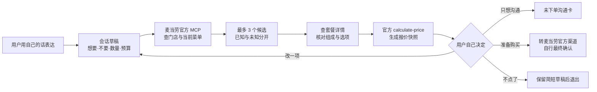

<p align="center">
  
</p>

<h1 align="center">慢慢点 · ManManDian</h1>

<p align="center"><strong>不催你，不替你决定。看得懂、改得动、算得清，最后仍由你作主。</strong></p>

<p align="center">一个基于麦当劳中国 MCP 的无障碍、自主、预算友好型点餐 Skill。</p>

> [!IMPORTANT]
> 「慢慢点」是参加“麦当劳程序员创意开发大赛”的独立参赛作品，**不是麦当劳官方产品，也不代表麦当劳、门店或 WorkBuddy 作出任何承诺**。当前项目包含按 WorkBuddy 项目级格式编写的 Skill 与经核验的只读流程原型，不是已经上线的点餐 App；尚不能代替用户创建订单、付款、取消、退款或取得取餐码。仓库目前尚未选择开源许可证，因此不能仅凭 Public 状态声称已经开源。

## 写在前面：一顿饭，也应该由自己决定

很多人并不是不知道自己想吃什么，只是屏幕太快、字太小、按钮太挤；也可能听不清、说不快、手指不方便，或者面对一串套餐、差价和优惠时，一时理不顺。

「慢慢点」不把这些人称为“麻烦”。它只把流程重新摆正：先听懂人的意思，再查真实菜单；先把价格说明白，再让人修改；不把沉默当同意，不把“随便”当授权，更不为了一张券多塞一件用户没要的东西。

我们想守住的不是“更快成交”，而是一个很朴素的权利：**我吃什么、买多少、花多少钱，由我自己说了算。**

### 中文小诗｜《慢慢点》

> 不催这一程，只把每一步放慢，<br>
> 不替你作主，只把真菜单摊开来看。<br>
> 听不清，就写；看不清，就把字放宽，<br>
> 手不方便，也能一项一项稳稳选完。<br>
> 三十元就是三十元，不让优惠偷换算盘，<br>
> 说不要就是不要，任何系统都不能擅自改判。<br>
> 愿每一次“我自己来”，都有耐心作伴，<br>
> 愿一顿寻常的热饭，入口有味，心里有暖。

### English Poem | *Take Your Time*

> No hurried hand, no choice made in your name;<br>
> We show the facts and keep your wish the same.<br>
> If words come softly, text can make them clear;<br>
> If screens feel distant, larger paths draw near.<br>
> A budget stays a promise, line by line;<br>
> “No” remains “no”; the final choice is thine.<br>
> May every simple meal you choose and share<br>
> Be served with truth, with dignity, with care.

## 一句话说明

「慢慢点」把用户自己的自然表达，转换成一份可修改的点餐草稿；再通过麦当劳官方 MCP 查询当前门店、在售菜单、套餐详情和实时核价，最后生成一张清楚标注“尚未下单”的报价卡或沟通卡。

它不是“替特殊人群点餐”，而是让不同的人用适合自己的方式，保有同样的决定权。

## 谁会用到它

- 不熟悉手机、自助点餐机或数字菜单的老年人
- 盲人、低视力用户，以及依赖读屏或放大显示的用户
- 聋人、听障用户，以及更愿意全程文字沟通的人
- 言语表达不便、紧张时说不清楚，或不愿开口的用户
- 精细动作不便、单手操作、容易误触的用户
- 对套餐结构、数量、差价、优惠和总价容易混淆的人
- 身处嘈杂环境、临时嗓子不适、抱着孩子或双手不便的普通用户
- 希望检查门店服务流程、减少沟通遗漏的产品和服务团队

这里不登记“你属于哪一类人”。系统只问一句更有用的话：**“怎样操作对你最方便？”**

## 它怎样工作



任何商品、数量、选项、门店、取餐方式或优惠发生变化，旧报价都会立即失效，再重新核价。这样做看起来“慢了一步”，实际上是在避免多买、买错和重复下单。

## 八个接地气的设计

### 1. 一轮只问一件事

不连续抛出十几个问题，也不要求用户先学会商品名。可以从“想吃夹鸡肉的”“两个人，三十元以内”“不要辣”这样的话开始。

### 2. 第一屏最多三个候选

每个候选都用相同结构说明：里面有什么、数量是多少、符合了哪些要求、还有哪些事情不知道。始终保留“换一批”“修改要求”“都不要”“先不点了”。

### 3. “不要”永远比推荐权重大

否定词、数量和预算属于硬约束。系统不能把“不要冰”听成“要冰”，不能把一份默默变成两份，也不能为了凑优惠加购用户没要的商品。

### 4. 预算不是建议，是护栏

金额在内部用整数“分”处理，最终价格只采用本轮 `calculate-price` 的官方返回。超预算时，先告诉用户超了多少，再由用户决定换餐品、减数量、改预算或停止。

### 5. 不知道，就明说不知道

菜单没有明确给出辣度、配料、过敏原或适宜性时，不靠模型常识补答案。项目不提供医疗、营养治疗或过敏安全结论。

### 6. 改一项，只改一项

用户改饮料，就只改饮料；其他选择原样保留。修改后明确复述前后差异，并把旧报价标记为失效。

### 7. 三张卡，三种状态，绝不混淆

- **报价卡**：说明本轮核价结果，醒目标注“尚未下单”。
- **沟通卡**：让用户自己拿给店员看，醒目标注“未下单”；不假装已经发到门店系统。
- **订单状态卡**：仅供未来取得真实订单回执后使用；当前版本不生成。

### 8. 退出也是一个完整结果

用户可以随时停下。系统不把退出写成失败，不用倒计时催促，也不以“都选到这里了”为理由诱导继续消费。

## 当前真实状态

最后核对日期：**2026-10-09（北京时间）**。

| 能力 | 当前状态 | 可以诚实地说什么 |
|---|---|---|
| WorkBuddy 项目级运行 Skill | 已提供，结构校验通过 | `.codebuddy/skills/manmandian/SKILL.md` 符合项目级 Skill 基本结构；仍需在干净 WorkBuddy 环境复测自动触发与完整任务 |
| 麦当劳 MCP 连接配置 | 已提供示例 | `mcp-config.example.json` 只含环境变量占位符，真实 Token 不入库 |
| 门店 → 菜单 → 详情 → 优惠查询 → 核价 | 仓库记录为真实只读验证 | 证据台账记录了 2026-10-09 的有限范围实测；本 README 修订未重新调用用户账号 |
| 自然语言约束、最多 3 个候选、预算护栏 | Skill 指令已定义 | 目前是智能体工作流，尚无自动化回归测试 |
| “未下单”报价卡与沟通卡 | Skill 指令已定义 | 能生成文字模板；尚无独立 UI 或门店端系统 |
| 跨入口共享草稿、局部改选 | 设计完成，未编码 | 仅在当前会话上下文中维持；不能声称已跨设备持久保存 |
| 大字、键盘、读屏界面 | 目标已定义，未实现、未实测 | 不能声称已通过 NVDA、VoiceOver、TalkBack 或 WCAG 验收 |
| 创建订单、取消、付款、退款、取餐码 | 关闭 / 未实现 | 当前只查询与核价，最终购买回到麦当劳官方渠道 |
| 手语识别 | 未实现 | 没有合法模型、词表和真实共创评估；相机不应开启 |
| 企业部署、门店后台、批量服务 | 未授权 | 只能讨论设计价值；不能把个人 MCP Token 用于企业运营 |

详细证据与限制见：

- [MCP_INTEGRATION.md](MCP_INTEGRATION.md)
- [docs/EVIDENCE_LEDGER.jsonl](docs/EVIDENCE_LEDGER.jsonl)
- [docs/MCP_CAPABILITY_MATRIX.md](docs/MCP_CAPABILITY_MATRIX.md)
- [docs/KNOWN_LIMITATIONS.md](docs/KNOWN_LIMITATIONS.md)
- [.codebuddy/skills/manmandian-builder/references/sources.md](.codebuddy/skills/manmandian-builder/references/sources.md)

> [!CAUTION]
> 旧 README 曾链接不存在的 `docs/SOURCE_REGISTER.md`；正确的来源登记当前位于 `.codebuddy/skills/manmandian-builder/references/sources.md`。旧文档还把“澳门是否支持”写成未知；麦当劳 MCP 官方指南和服务规则已经明确：服务面向中国大陆地区，**不含港澳台**。

## 两个真实生活场景

### 场景 A：预算有限，但不知道商品名

用户说：

> 两个人，三十元以内，想吃夹鸡肉的，不要辣。

「慢慢点」会：

1. 保留“两个人、总预算 30 元、鸡肉、不辣”四项原话。
2. 询问大概位置与取餐方式，一轮只问一个主要问题。
3. 查询用户选择的门店和当前在售菜单。
4. 只有官方详情能证明“鸡肉”时才标为符合；没有辣度字段时写“辣度还不能确认”，而不是擅自写“不辣”。
5. 给出最多 3 个候选并逐一核价；没有方案在预算内时，如实说明，不偷偷放宽预算。
6. 用户改一项后保留其他选择，重新核价。

### 场景 B：不方便说话，想给店员看文字

用户全程打字完成选择后，Skill 生成：

```text
【给店员看的文字｜未下单】
您好，我想购买：
1. …… × 1

我的明确要求：
- ……

请帮我现场确认：
- ……

当前参考总额：¥……（价格与供应以门店现场/官方渠道为准）
请在这台设备上用文字回复我，谢谢。
```

这张卡由用户自己出示。它不会写“已经发给店员”，也不会假装接入门店收银、叫号或后台系统。

## 对个人有用，也要对企业说真话

| 对象 | 能带来的价值 | 当前边界 |
|---|---|---|
| 顾客 | 少记商品名、少被复杂套餐绕晕；预算、数量、否定和总价更清楚；随时能改、能停 | 仍需用户在官方渠道完成最终下单与付款 |
| 家人或陪同者 | 可以帮忙解释操作，但不替本人作选择；草稿让沟通过程可回看 | 不应接管账号、Token 或默认授权 |
| 门店员工 | 一张结构化文字卡可减少重复询问，明确“用户要什么”和“还需确认什么” | 首版不要求员工安装后台，也不声称卡片已发送到门店 |
| 产品与服务团队 | 可用真实任务衡量可理解性、纠错恢复、预算遵守和辅助技术可用性 | 目前没有用户研究数据，不能宣称提升转化率、降低成本或提高满意度 |
| 企业 | 可作为无障碍服务流程、沟通卡、错误防护和评估框架的原型 | 麦当劳 MCP 当前授权是个人、非商业、不可转让的有限使用权；企业试点或商业部署须另获书面授权 |

“帮助企业”在这里不等于拿个人 Token 做门店系统。它意味着先把顾客容易卡住的地方说清楚，让企业看见服务流程里可以改进的环节，并用合规、匿名、可验证的指标做后续共创。

## 合规边界：这里必须说得比宣传更清楚

根据麦当劳 MCP 官方指南与服务规则：

- 服务面向中国大陆地区，不含港澳台。
- Token 与个人麦当劳会员账号强绑定，持有 Token 可能意味着拥有账号操作能力。
- Token 只能保存在本地受保护配置中；不得提交 GitHub、写入日志、贴进对话、共享给他人或交给未经认可的平台。
- 当前授权限于个人、非商业、正常使用；不得代下单、代领券、商业牟利、批量、高频或无人值守自动调用。
- 官方指南注明接口有频率限制；出现 429 时应停止连续调用并稍后重试，而不是并发重放。
- 第三方 AI 可能误解接口数据。优惠、活动、会员权益和最终订单状态以麦当劳官方渠道实际显示为准。

因此，本项目默认关闭：

- `create-order`
- `cancel-order`
- `auto-bind-coupons`
- 积分兑换、抽奖和任何改变账户权益的工具
- 企业代客调用、共享账号、批量运营、无人值守自动化

如果未来开放写操作，必须同时具备：规则允许、用户对本次具体订单明确授权、代码级防重复门禁、完整报价快照、超时后先查单而不是重下，以及创建/付款/可取餐/取消/退款的状态分离。仅靠一句“确认”或一段提示词不够。

## 无障碍不是一句口号

未来独立界面以 [WCAG 2.2](https://www.w3.org/TR/WCAG22/) AA 为最低设计与测试基线，并优先覆盖完整点餐任务，而不只检查首页。以下均是**待实现、待测试的验收目标**，不是当前成绩：

- 所有非文字内容有等价文本；不用颜色或图标单独传达状态。
- 全流程可用键盘完成，无键盘陷阱，焦点顺序合理且始终可见。
- 正文对比度至少 4.5:1，大号文字至少 3:1。
- 指针目标至少满足 WCAG 2.2 的 24×24 CSS px 最低要求；本项目对主要操作建议采用更宽松的 44×44 CSS px 设计目标。
- 支持文字放大与窄屏重排，不要求横向滚动才能理解主要内容。
- 核价完成、报价失效、网络错误等状态能被辅助技术读取，而不强迫焦点跳走。
- 拖拽、长按、双击和手势都提供普通点击或键盘替代。
- 不设置不可关闭的倒计时；超时前保留草稿并允许恢复。
- 用 NVDA、VoiceOver、TalkBack 至少各完成一次真实任务测试，并保留测试环境、步骤、失败记录与修复结果。

## 关于手语：宁可暂时不做，也不把手势识别冒充手语理解

手语不是几张手势图片，也不是“比个赞就等于确认”。在没有中国手语使用者共创、合法数据与模型、限定词表、拒识机制和真实评估前，本项目不开放相机和手语识别。

未来研究也必须分层命名：

- **G0：通用手势快捷操作**，例如返回或放大；不称为手语。
- **S1：限定词汇实验**，只在明确词表内给出候选，并允许拒识。
- **S2：连续手语理解研究**，不是当前交付能力。

相机默认关闭；每次开启都需单独同意；退出即停流；原始视频默认不保存；数量、否定和交易意图必须再次以文字确认，永远不能由一次识别直接触发交易。

## 安装与使用

### 前置条件

- 位于麦当劳 MCP 支持的中国大陆地区
- 本人拥有可用的麦当劳会员账号，并自行申请 MCP Token
- 已安装支持 Streamable HTTP MCP 的客户端；比赛推荐使用 WorkBuddy
- Token 只在本人设备的本地连接器中配置

### 1. 获取 MCP Token

访问 [麦当劳 MCP 开放平台](https://open.mcd.cn/mcp)，登录后在控制台激活并复制 Token。申请和使用即表示需要遵守麦当劳相关使用条款与 MCP 服务规则。

### 2. 在 WorkBuddy 中配置连接器

打开 WorkBuddy：**专家·技能·连接器 → 连接器 → 自定义连接器 → 配置 MCP**，在本地配置：

```json
{
  "mcpServers": {
    "mcd-mcp": {
      "type": "streamablehttp",
      "url": "https://mcp.mcd.cn",
      "headers": {
        "Authorization": "Bearer YOUR_MCP_TOKEN"
      }
    }
  }
}
```

把 `YOUR_MCP_TOKEN` 替换为真实 Token，但**只替换 WorkBuddy 本机配置中的值**。仓库里的 `mcp-config.example.json` 必须继续使用 `${MCD_MCP_TOKEN}` 占位符，不能写入真实 Token。

### 3. 加载项目 Skill

克隆或下载本仓库，用 WorkBuddy 打开仓库根目录。项目级 Skill 位于：

```text
.codebuddy/skills/manmandian/SKILL.md
```

WorkBuddy 可在相关任务中自动选择 Skill，也可以在对话中明确说：

```text
请使用慢慢点帮我看一份麦当劳菜单。先不要下单，一轮只问我一个问题。
```

其他例子：

```text
我在上海虹桥附近，两个人，预算 50 元，不喝冰的。只查菜单和核价。
```

```text
我不方便说话。请全程用短句，最后给我一张明确写着“未下单”的店员沟通卡。
```

```text
我用读屏。请少用表格，把商品、数量、价格、未知项和当前状态逐条写清楚。
```

## MCP 使用范围

当前主流程只使用五类只读或核价工具：

| Tool | 用途 | 当前策略 |
|---|---|---|
| `query-nearby-stores` | 查询附近可用门店 | 用户选择，不自动取最近门店 |
| `query-meals` | 查询该门店当前可售菜单 | 只使用本轮返回，不用旧菜单补全 |
| `query-meal-detail` | 查询套餐组成、换项与特调信息 | 已知与未知分开，不猜配料或辣度 |
| `query-store-coupons` | 查看当前门店、本账户可用优惠 | 只查看；不自动领取，不为券加购 |
| `calculate-price` | 计算当前草稿总价 | 金额用整数分处理；修改后重新核价 |

工具参数、已验证范围与反例限制见 [MCP_INTEGRATION.md](MCP_INTEGRATION.md)。不要从 README 猜接口 schema；以客户端当前 `tools/list` 和真实返回为准。

## 技术原则

### 报价快照

一份有效报价必须绑定：

```text
门店 + 取餐方式 + 商品编码 + 数量 + 套餐选项 + 优惠 + 总价 + 核价时间
```

任一项改变，状态从 `VALID` 变为 `STALE`。界面不能继续显示旧报价像仍然有效。

### 金额

- 内部使用整数分，不使用浮点金额作为交易判断。
- 菜单展示价与最终核价分开。
- 优惠前、优惠金额、差价和应付总额分别展示。
- 核价失败时不心算、不猜价、不承诺仍在预算内。

### 失败恢复

| 情况 | 处理 |
|---|---|
| 401 | 请用户在本地检查 Token 是否缺失、无效或过期；绝不要求把 Token 发到聊天中 |
| 429 | 停止连续调用并稍后重试；不并发轰击接口 |
| 网络断开 | 标明离线状态和上次查询时间；未经重新核价不得继续交易步骤 |
| 菜单变化 | 保留用户意图，重新查询对应商品，不整份清空 |
| 报价过期 | 保留草稿，重新核价，并明确旧报价失效 |
| 创建结果未知 | 当前版本不会发生；未来必须先查订单，不能直接重下 |

## 怎么衡量“真的帮到人”

不拿“点得更快”当唯一成功指标，也不预填好看的数字。真实试点应至少记录：

- 用户是否能说清或选出自己想要的东西
- 用户能否复述商品数量与总价
- 预算是否被严格遵守
- “不要”、数量和套餐修改是否被正确保留
- 发生误解后能否只改一项而恢复
- 用户能否随时停止并知道当前没有下单
- 使用读屏、键盘、放大或纯文字模式时，完整任务是否成功
- 员工看沟通卡后还需要补问几次
- 报价与最终官方渠道显示是否一致
- 用户的主观感受是否是“我自己完成了”，而不是“系统替我做了”

所有指标必须来自明确同意的真实研究；只汇总完成改进所需的最少数据，不收集残疾诊断，不把退出率简单解释成“转化损失”。

## 项目结构

```text
MM-helper/
├── README.md
├── CONTEST_DECLARATION.md          # 官方原文，禁止修改
├── MCP_INTEGRATION.md
├── mcp-config.example.json         # 只能放占位符
├── workbuddy.md
├── .codebuddy/
│   ├── CODEBUDDY.md
│   ├── rules/manmandian.md
│   └── skills/
│       ├── manmandian/SKILL.md     # 面向用户的运行 Skill
│       └── manmandian-builder/     # 面向开发的治理 Skill
├── docs/
│   ├── EVIDENCE_LEDGER.jsonl
│   ├── MCP_CAPABILITY_MATRIX.md
│   ├── KNOWN_LIMITATIONS.md
│   └── FILE_MAP.md
└── assets/
    └── manmandian-hero-16x9.png
```

> [!NOTE]
> 参赛说明要求项目包含“源代码或可运行内容”。本仓库已有可加载的 WorkBuddy Skill，但仍缺少独立应用代码与自动测试。为了降低报名审核和实际复现风险，建议在报名前补一个最小可运行演示、fixture 测试和清晰的验证命令；不要把规划中的 `src/` 写成已经完成。

## 路线图

- [x] 核验比赛必需文件、官方声明与 MCP 连接方式
- [x] 建立只读运行 Skill、事实分层、证据台账与限制说明
- [x] 记录一次有限范围的真实只读链路证据
- [x] 重写 README 与 Skill，补齐地域、资格、企业授权和 MCP 服务规则边界
- [ ] 建立最小可运行演示与自动测试
- [ ] 实现会话草稿、整数分金额模型和报价失效状态机
- [ ] 实现文字优先、键盘可达、读屏可读、大字与窄屏界面
- [ ] 用 NVDA、VoiceOver、TalkBack 和真实用户任务测试，保留失败记录
- [ ] 与手语使用者共同决定 S1 是否值得推进；条件不足就继续保持关闭
- [ ] 只有在规则、授权、安全代码与真实测试全部到位后，才重新评估写操作

## 参赛前必须再核对

以 [麦当劳程序员创意开发大赛官方仓库](https://github.com/M-China/mcd-developer-innovation-challenge) 和 [完整活动规则](https://github.com/M-China/mcd-developer-innovation-challenge/blob/main/activityGuidelines.md) 的最新内容为准。

- [ ] GitHub 仓库保持 Public，创建时间符合官方窗口
- [ ] `README.md` 包含项目介绍、安装方法、使用示例和目标用户
- [ ] `CONTEST_DECLARATION.md` 与官方原文一致，**一个字都不要改**
- [ ] `MCP_INTEGRATION.md` 如实写出 Server、Tool、调用流程和业务价值
- [ ] `mcp-config.example.json` 只含环境变量占位符，无真实 Token
- [ ] 仓库包含可运行 Skill；最好补最小演示与测试，降低“只有文档”的审核风险
- [ ] 若申请 WorkBuddy 专项奖励，提交真实、完整、已脱敏的 `workbuddy.md`；当前仓库中的摘要版有核验风险，应由作者从真实会话导出后替换
- [ ] 作者确认资格：官方规则允许年满 18 周岁的中国大陆地区合法居民参加；未满 18 周岁者需征得父母或法定监护人同意
- [ ] 在 **2026-10-25 23:59（北京时间）** 前按指定 Issue 格式报名；正文不超过 1000 字且不要附图
- [ ] 仓库没有 Token、手机号、地址、订单信息、支付信息或他人个人信息
- [ ] AI 主视觉、字体、代码、模型与数据来源已写入第三方说明
- [ ] 选择并添加合适的开源许可证；Public 不自动等于开源，当前仓库尚无 LICENSE

## WorkBuddy 更新仓库后，怎样上传到 GitHub

WorkBuddy 修改文件后，变化首先只在本地工作区里。**看到文件更新，不等于 GitHub 已经更新。**还需要检查、提交和推送。

### 方案 A：当前就在 `main` 分支

在 WorkBuddy 的仓库终端中依次执行：

```bash
git status --short
git diff --check
git diff
```

逐文件确认无误后，只添加本次确实要上传的文件；不要习惯性使用 `git add .`。下面三项只是常见示例；如果 `git status --short` 还列出了本次同步修改的说明文档，应审查后逐一添加，不能漏传，也不能顺手带上无关文件：

```bash
git add README.md
git add assets/manmandian-hero-16x9.png
git add .codebuddy/skills/manmandian/SKILL.md
git diff --cached
```

特别检查暂存差异中没有真实 Token、手机号、精确地址、支付信息，也没有改动 `CONTEST_DECLARATION.md`。然后提交并同步：

```bash
git commit -m "feat: refine ManManDian accessibility skill"
git pull --rebase origin main
git push origin main
```

最后打开 GitHub 仓库，确认 README 图片可见、三个文件路径正确、最近提交就是刚才的提交。

### 方案 B：WorkBuddy 为任务创建了 `workbuddy/...` 分支

先看当前分支：

```bash
git branch --show-current
```

若名称类似 `workbuddy/main-a3f8c2b1`，不要把它误当成 `main`，也不要强推。检查并提交后：

```bash
git add README.md
git add assets/manmandian-hero-16x9.png
git add .codebuddy/skills/manmandian/SKILL.md
git diff --cached
git commit -m "feat: refine ManManDian accessibility skill"
git push -u origin HEAD
```

随后到 GitHub 创建 Pull Request，把该分支合并到 `main`。合并前再次确认官方声明未被修改、CI 或检查通过、主视觉和相对链接能够正常显示。

### 可以直接发给 WorkBuddy 的上传指令

```text
请在当前 MM-helper 仓库中读取 git status --short，识别这次任务实际修改的
README、Skill、图片和配套说明文件；不要把范围固定成三个文件，也不要加入
与本次任务无关的文件。

先执行 git status、git diff --check 和逐文件 diff；检查没有 Token、手机号、
精确地址、支付信息或其他个人数据，且不要修改 CONTEST_DECLARATION.md。
逐个检查并把拟提交文件列给我确认。得到我确认后再 commit。
如果当前是 main，先安全同步远端再 push origin main；如果当前是
workbuddy/* 分支，则 push origin HEAD 并告诉我如何创建 PR。
禁止 force push，禁止把本地代理、凭证或缓存文件提交到仓库。
```

若 Git 凭证弹窗、代理或锁文件导致推送失败，不要连续重试或删除整个 Git 配置。先确认没有其他 Git 进程正在运行，再检查 GitHub 登录、仓库写权限、远端地址与本机网络；机器专用的代理命令不应写进公共 README。

## 报名 Issue 模板

以下正文保持简短，不附图片，并在提交前以官方最新模板为准：

```text
【参赛申请】
项目名称：慢慢点（ManManDian）
项目地址：https://github.com/siyunhao2025-beep/MM-helper
项目简介：一个基于麦当劳中国 MCP 的无障碍自主点餐 Skill。它把用户自己的自然表达转成可修改草稿，查询当前门店真实菜单与套餐详情，给出最多三个候选并进行官方核价；通过预算护栏、否定与数量复核、报价失效机制及“未下单”沟通卡，帮助老年人、残障用户和临时不方便开口或操作的人自己作决定。当前版本只读到核价，不代下单、不付款、不自动领券。
```

## 资料与依据

- [麦当劳程序员创意开发大赛官方仓库](https://github.com/M-China/mcd-developer-innovation-challenge)
- [麦当劳程序员创意开发大赛活动规则](https://github.com/M-China/mcd-developer-innovation-challenge/blob/main/activityGuidelines.md)
- [麦当劳中国 MCP Server 官方指南](https://github.com/M-China/mcd-mcp-server)
- [麦当劳 MCP 开放平台](https://open.mcd.cn/mcp)
- [麦当劳 MCP 服务规则](https://cdn.mcd.cn/cms/pages/MCPServerRules.html)
- [WorkBuddy 连接器说明](https://www.workbuddy.cn/docs/workbuddy/From-Beginner-to-Expert-Guide/Function-Description/Connector)
- [WorkBuddy / CodeBuddy 项目级 Skills 文档](https://www.workbuddy.cn/docs/cli/skills)
- [WorkBuddy Git 集成与 Worktree 说明](https://www.workbuddy.cn/docs/workbuddy/From-Beginner-to-Expert-Guide/Function-Description/Worktree-Task)
- [W3C Web Content Accessibility Guidelines 2.2](https://www.w3.org/TR/WCAG22/)

## 许可与素材

- 麦当劳、McDonald’s 及相关商标、商品与数据权利归其权利人所有；本项目不主张相关权利，也不暗示官方背书。
- 主视觉 `assets/manmandian-hero-16x9.png` 为本项目生成的原创概念插画，不含麦当劳 Logo、官方包装或真实顾客肖像。提交时请同步更新 `THIRD_PARTY_NOTICES.md`。
- 代码许可证目前待作者选择。建议在核对依赖与比赛要求后添加明确的 `LICENSE`；在此之前，外部使用者没有默认的复制、修改或再分发授权。

---

<p align="center"><strong>慢一点，不是落后一步；是把决定权，稳稳交回每个人手里。</strong></p>
