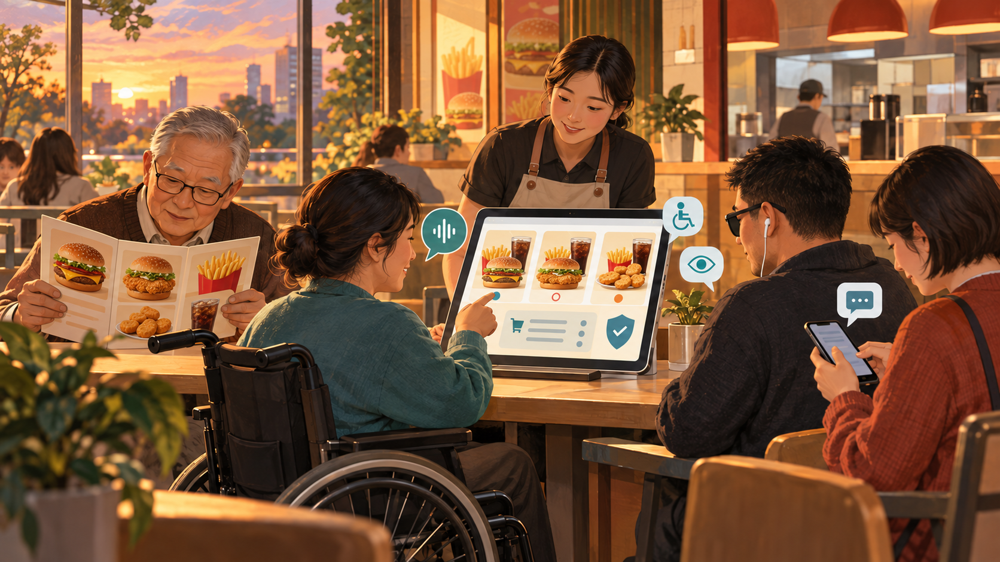
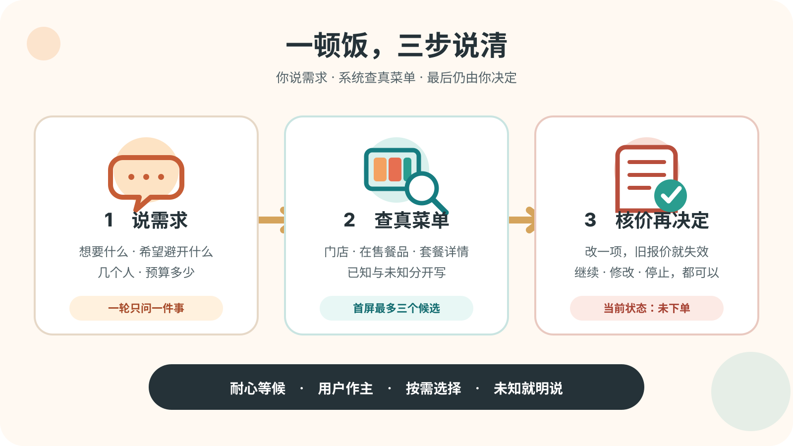
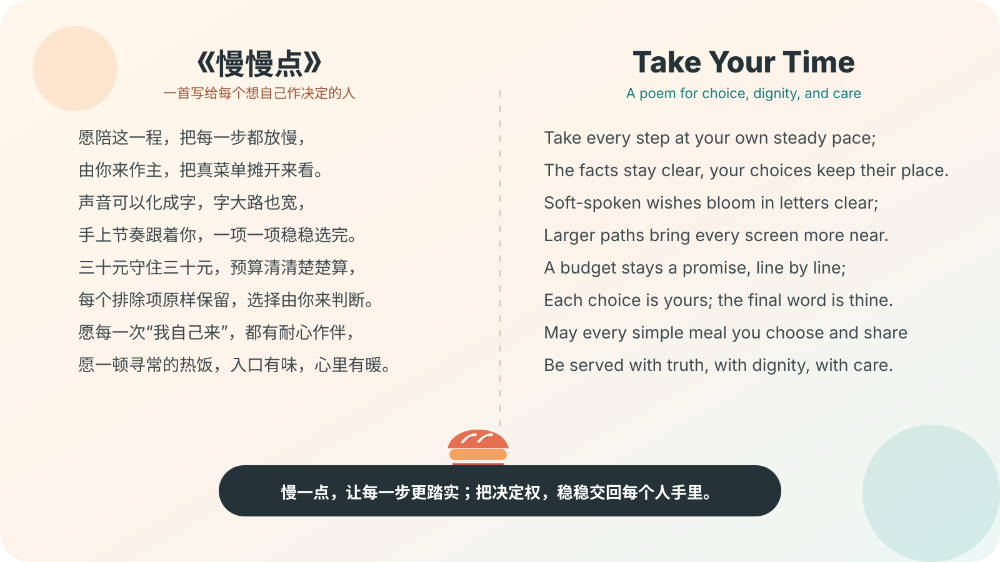
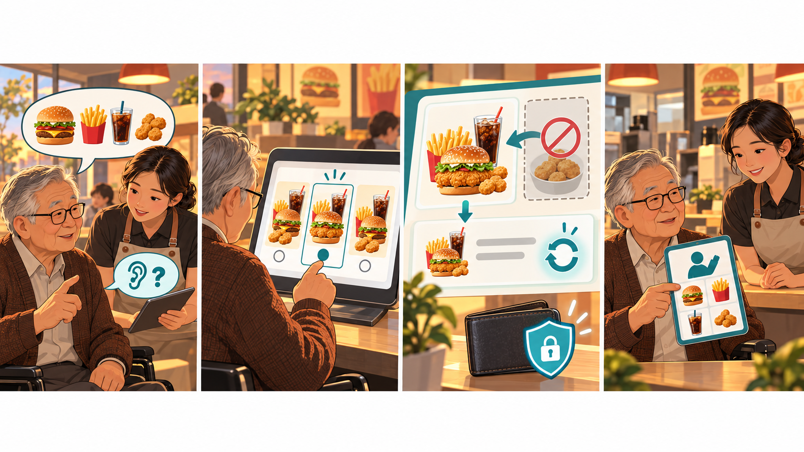
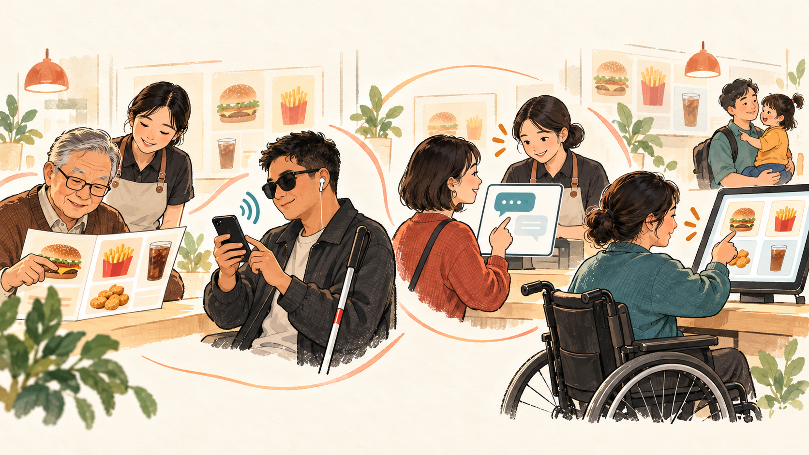
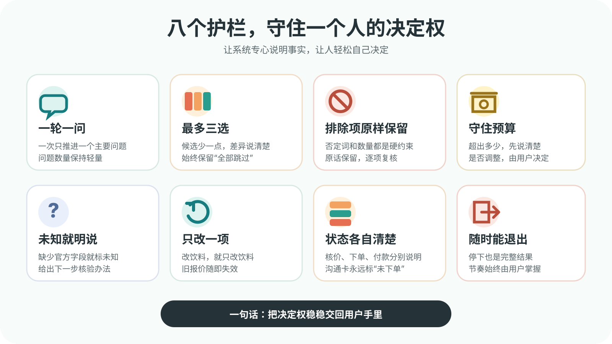
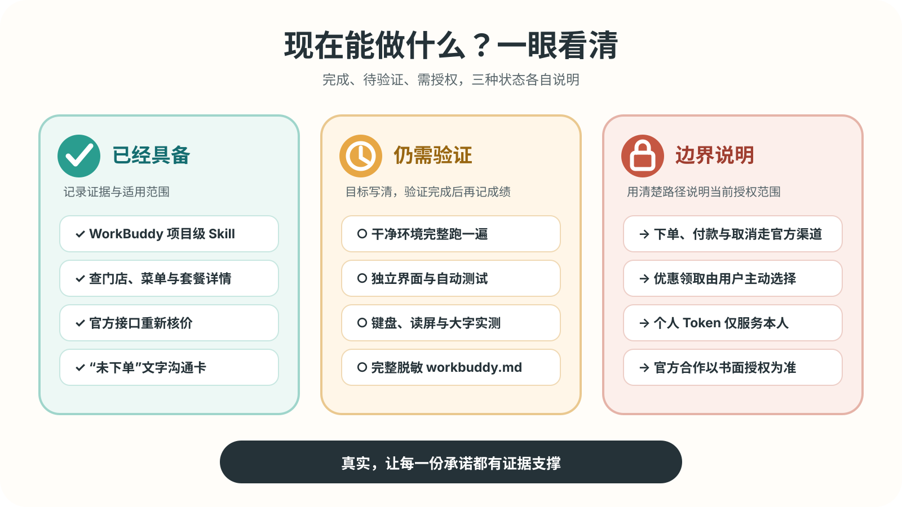

  

<h1 align="center">慢慢点 · ManManDian</h1>

<strong>陪你慢慢选，由你做决定。看得懂、改得动、算得清，每一步都由你作主。</strong>

无障碍优先　·　真实菜单　·　预算护栏　·　只读到核价　·　始终标明“未下单”

> [!IMPORTANT]
> 这是参加“麦当劳程序员创意开发大赛”的独立参赛作品；麦当劳官方产品与承诺请以官方渠道为准。当前交付是 WorkBuddy 项目级 Skill 与只读流程原型，能力止于查门店、看菜单、比较和核价；下单、付款、取消与取餐码均由用户在官方渠道完成。仓库授权范围仍待 LICENSE 明确；Public 目前只代表公开可见。

## 20 秒看懂

  

用户只要从一句日常话开始：

> 两个人，三十元以内，想吃夹鸡肉的，希望避开辣味。

「慢慢点」负责把这句话变成可修改的草稿，去查真实门店菜单和价格；**吃什么、买多少、是否继续，始终由用户决定。**

> 图片负责把故事讲得更直观；文字与替代文本同步承载同一信息，让读屏用户、搜索引擎和比赛审查都能完整理解。

## 一顿普通的饭，也值得被认真对待

很多人清楚自己想吃什么，只是屏幕节奏、文字大小、按钮密度、声音交流或手部操作方式各有需求。

我们的目标超越“更快成交”，回到一件很朴素的事：**这一顿饭，由我自己说了算。**

  

<strong>读屏文字版：中英文两首诗</strong>

### 中文小诗｜《慢慢点》

> 愿陪这一程，把每一步都放慢， 
> 由你来作主，把真菜单摊开来看。 
> 声音可以化成字，字大路也宽， 
> 手上节奏跟着你，一项一项稳稳选完。 
> 三十元守住三十元，预算清清楚楚算， 
> 每个排除项原样保留，选择由你来判断。 
> 愿每一次“我自己来”，都有耐心作伴， 
> 愿一顿寻常的热饭，入口有味，心里有暖。

### English Poem | Take Your Time

> Take every step at your own steady pace; 
> The facts stay clear, your choices keep their place. 
> Soft-spoken wishes bloom in letters clear; 
> Larger paths bring every screen more near. 
> A budget stays a promise, line by line; 
> Each choice is yours; the final word is thine. 
> May every simple meal you choose and share 
> Be served with truth, with dignity, with care.

## 一次点餐，就是这四幅画

  

<strong>① 说需求　→　② 看三选　→　③ 守预算并重新核价　→　④ 自己出示沟通卡</strong>

<strong>展开看两个日常场景</strong>

### 场景 A｜预算有限，商品名还在熟悉

用户只说“两个人、三十元以内、夹鸡肉的、希望避开辣味”。Skill 会逐项保留原话，查询用户选择的门店，最多给三个候选。只有官方详情明确的属性才写“符合”；缺少辣度字段时标为“未知”，所有答案都来自可核验信息。

### 场景 B｜偏好文字交流，想给店员看清单

Skill 可以生成：

~~~text
【给店员看的文字｜未下单】
您好，我想购买：
1. …… × 1

我的明确要求：
- ……

请帮我现场确认：
- ……

当前参考总额：¥……（价格与供应以门店现场或官方渠道为准）
请在这台设备上用文字回复我，谢谢。
~~~

这张卡由用户自己出示，并始终写明“未下单”；门店收银、叫号与后台系统继续保持各自独立。

## 每个人，都可以用适合自己的方式

  

- 文字较难看清：短句、大字友好、所有图标都有文字。
- 偏好文字交流：全程文字，最后生成沟通卡。
- 手部操作需要从容节奏：一步一问，改一项只动一项。
- 商品名还在熟悉：从“想吃夹鸡肉的”这种日常表达开始。

这里直接询问操作偏好，省略身份分类：**怎样操作对你最方便？**

## 八个护栏，比八句口号更有用

  

<strong>读屏文字版：八项原则</strong>

1. 一轮只问一个主要问题。
2. 第一屏最多三个候选，并保留“全部跳过”。
3. 排除项、数量和预算属于硬约束。
4. 超预算先说明差额，再由用户选择调整方式。
5. 辣度、配料和过敏信息缺少官方字段时标为未知。
6. 改饮料就只改饮料，其他选择维持原样。
7. 核价、下单、付款、可取餐分别表述。
8. 用户随时可以停止；退出同样是完整结果。

## 当前真实状态

  

最后核对：**2026-10-09（北京时间）**。

<strong>展开查看完整能力表与证据边界</strong>

| 能力 | 当前状态 | 可以诚实地说什么 |
|---|---|---|
| WorkBuddy 项目级运行 Skill | 已提供，结构校验通过 | 位于 .codebuddy/skills/manmandian/SKILL.md；仍需在干净 WorkBuddy 环境复测完整任务 |
| MCP 连接配置 | 已提供示例 | mcp-config.example.json 只放环境变量占位符，真实 Token 仅保存在本机配置 |
| 门店 → 菜单 → 详情 → 优惠查询 → 核价 | 有限范围历史实测 | 证据台账记录了 2026-10-09 的只读调用；本轮 README 修订沿用历史证据，用户账号调用次数为零 |
| 最多三个候选、预算护栏 | Skill 已定义 | 尚无自动化回归测试 |
| “未下单”报价卡与沟通卡 | Skill 已定义 | 尚无独立 UI 或门店后台 |
| 跨入口共享草稿 | 设计完成，未编码 | 目前只维持当前会话上下文，跨设备保存仍待实现 |
| 大字、键盘、读屏界面 | 目标已定义，开发与实测待完成 | NVDA、VoiceOver、TalkBack 与 WCAG 验收列入下一阶段 |
| 创建订单、取消、付款、退款、取餐码 | 官方渠道承接 | 最终购买回到麦当劳官方渠道 |
| 手语识别 | 研究准备中 | 合法模型、词表与真实共创评估条件齐备后再启用相机 |
| 企业部署、门店后台、批量服务 | 需另行授权 | 当前聚焦流程设计价值，个人 Token 仅服务本人 |

证据与限制：

- [MCP_INTEGRATION.md](MCP_INTEGRATION.md)
- [docs/EVIDENCE_LEDGER.jsonl](docs/EVIDENCE_LEDGER.jsonl)
- [docs/MCP_CAPABILITY_MATRIX.md](docs/MCP_CAPABILITY_MATRIX.md)
- [docs/KNOWN_LIMITATIONS.md](docs/KNOWN_LIMITATIONS.md)
- [.codebuddy/skills/manmandian-builder/references/sources.md](.codebuddy/skills/manmandian-builder/references/sources.md)

## 对个人有用，也让企业看见该改哪里

  

| 顾客 | 门店员工 | 产品与企业团队 |
|---|---|---|
| 少记商品名，预算、数量和总价更清楚 | 沟通卡把“想要什么”和“还需确认什么”分开 | 看见误解、误触、重复确认与退出恢复发生在哪里 |
| 随时能改、能停，最后自己决定 | 首版采用零后台安装的沟通卡 | 先做匿名、合规、可验证的流程共创 |

> [!CAUTION]
> “帮助企业”的当前含义是流程共创与评估设计，个人 Token 仅服务本人。门店试点、批量服务或商业部署必须另获麦当劳书面授权，并完成隐私、安全、无障碍和运营评审。真实研究数据仍待形成，转化率、成本与满意度等效果指标将由后续研究验证。

## 四条始终清楚的边界

- **地域**：麦当劳 MCP 服务范围为中国大陆地区，港澳台位于该范围外。
- **账号**：Token 与个人会员账号强绑定，只放在本人设备的受保护配置中。
- **使用**：当前授权限于个人、非商业、正常交互；企业代客、批量、高频与无人值守调用均位于授权范围外。
- **交易**：当前交易路径统一回到麦当劳官方渠道；优惠领取、积分与活动权益均由用户主动选择。

<strong>展开查看隐私、优惠与未来写操作要求</strong>

- Token 仅进入本人设备的受保护连接器配置。
- 请求信息限于完成点餐所需的最小范围，支付密码、身份证号与银行卡号始终由用户保管。
- 查询优惠与领取优惠分开处理；默认执行查询，领取由用户主动选择，餐品保持用户原有需求。
- 第三方 AI 可能误解接口数据，优惠、权益和最终订单状态以官方渠道为准。
- 如果未来开放写操作，必须同时具备：规则允许、用户对本次具体订单明确授权、代码级防重复门禁、完整报价快照、超时后优先查单，以及创建、付款、可取餐、取消、退款的状态分离。
- 真实交易保护需要明确授权、代码门禁与官方回执共同成立。

## 安装与使用

### 1｜申请个人 MCP Token

访问 [麦当劳 MCP 开放平台](https://open.mcd.cn/mcp)，由本人登录、激活并复制 Token。

### 2｜在 WorkBuddy 本机配置连接器

进入：**专家·技能·连接器 → 连接器 → 自定义连接器 → 配置 MCP**。

<strong>展开复制连接器配置</strong>

~~~json
{
  "mcpServers": {
    "mcd-mcp": {
      "type": "streamablehttp",
      "url": "https://mcp.mcd.cn",
      "headers": {
        "Authorization": "Bearer YOUR_MCP_TOKEN"
      }
    }
  }
}
~~~

只在 WorkBuddy 本机配置里替换 YOUR_MCP_TOKEN。仓库中的 mcp-config.example.json 继续使用 ${MCD_MCP_TOKEN} 占位符，真实 Token 始终留在本机。

### 3｜用 WorkBuddy 打开仓库，说一句话

项目级 Skill 位于：

~~~text
.codebuddy/skills/manmandian/SKILL.md
~~~

可以直接说：

> 请使用慢慢点帮我看一份麦当劳菜单。先保持只读状态，一轮只问我一个问题。

也可以说：

- 我在上海虹桥附近，两个人，预算 50 元，希望避开冰饮。只查菜单和核价。
- 我偏好文字交流，请全程用短句，最后给我一张写着“未下单”的沟通卡。
- 我用读屏，请少用表格，把商品、数量、价格、未知项和状态逐条写清楚。

<strong>技术读者：MCP 工具、报价快照与故障恢复</strong>

### 当前主流程

| Tool | 用途 | 当前策略 |
|---|---|---|
| query-nearby-stores | 查询附近门店 | 用户从真实结果中自己选择 |
| query-meals | 查询当前在售菜单 | 只使用本轮返回 |
| query-meal-detail | 查询组成、换项与特调 | 已知和未知分开，缺失字段标为未知 |
| query-store-coupons | 查看可用优惠 | 默认只查看，领取由用户主动选择 |
| calculate-price | 计算当前草稿总价 | 金额用整数分，修改后重新核价 |

接口 schema 请以运行时的当前 tools/list 与真实返回为准。

### 报价快照

一份有效报价必须绑定：

~~~text
门店 + 取餐方式 + 商品编码 + 数量 + 套餐选项 + 优惠 + 总价 + 核价时间
~~~

任一项改变，状态从 VALID 变为 STALE；界面只展示最新有效报价。

### 异常恢复

| 情况 | 处理 |
|---|---|
| 401 | 请用户在本地检查 Token，Token 始终留在本机配置 |
| 429 | 停止连续与并发调用，稍后再试 |
| 网络断开 | 标明离线和上次查询时间，重新核价后再继续交易步骤 |
| 菜单变化 | 保留用户意图，重新查询对应商品 |
| 报价过期 | 保留草稿，明确旧报价失效 |
| 创建结果未知 | 当前版本保持只读；未来先查订单，再决定后续动作 |

<strong>无障碍、手语与真实评估目标</strong>

### 无障碍验收目标

未来独立界面以 [WCAG 2.2](https://www.w3.org/TR/WCAG22/) AA 为设计与测试基线。以下内容属于待实现目标，当前状态已在上方看板明确标注：

- 所有非文字内容都有等价文本，颜色与图标同时配有文字状态。
- 全流程可用键盘完成，无键盘陷阱，焦点顺序合理并始终可见。
- 正文对比度至少 4.5:1，大号文字至少 3:1。
- 指针目标至少满足 24×24 CSS px；主要操作建议采用 44×44 CSS px。
- 支持文字放大与窄屏重排。
- 核价完成、报价失效和网络状态变化可被辅助技术读取。
- 拖拽、长按、双击和手势都有普通点击或键盘替代。
- 使用 NVDA、VoiceOver、TalkBack 完成真实任务测试并记录每次结果与改进过程。

### 关于手语

手语是一套完整语言。项目将在中国手语使用者共创、合法数据与模型、限定词表、低置信度回退机制和真实评估全部到位后，再开放相机与手语识别。

任何未来识别结果都只作为候选，交易永远由食客决定。

- G0：命名为通用手势快捷操作。
- S1：限定词汇实验，只在词表内给候选，低置信度时回到文字确认。
- S2：连续手语理解属于后续研究。

### 怎么衡量“真的帮到人”

- 用户是否能说清自己想要的东西。
- 用户能否复述数量与总价。
- 预算、排除项和局部修改是否被严格保留。
- 发生误解后能否只改一项而恢复。
- 用户是否清楚当前状态为“未下单”并能随时停止。
- 使用读屏、键盘、放大或纯文字模式时，完整任务是否成功。
- 员工看沟通卡后还需要补问几次。
- 用户的感受是否突出“我自己完成了”。

指标必须来自取得同意的真实研究；数据范围限于改进任务所需的最少信息，退出被视为用户作出的有效选择。

<strong>开发者：项目结构与路线图</strong>

~~~text
MM-helper/
├── README.md
├── CONTEST_DECLARATION.md
├── MCP_INTEGRATION.md
├── mcp-config.example.json
├── workbuddy.md
├── .codebuddy/
│   ├── CODEBUDDY.md
│   ├── rules/manmandian.md
│   └── skills/
│       ├── manmandian/SKILL.md
│       └── manmandian-builder/
├── docs/
│   ├── EVIDENCE_LEDGER.jsonl
│   ├── MCP_CAPABILITY_MATRIX.md
│   ├── KNOWN_LIMITATIONS.md
│   └── FILE_MAP.md
└── assets/
    ├── manmandian-hero-16x9.png
    ├── manmandian-story-4-panels.png
    ├── manmandian-accessible-ways.png
    ├── manmandian-co-design.png
    ├── manmandian-three-steps.svg
    ├── manmandian-eight-guardrails.svg
    ├── manmandian-status-board.svg
    └── manmandian-poems.svg
~~~

### 已完成

- 核验比赛文件、官方声明、MCP 指南与服务规则。
- 建立运行 Skill、事实分层、证据台账和限制说明。
- 记录有限范围的真实只读链路证据。
- 完成视觉叙事版 README、四张卡通插画和四张 SVG 信息图。

### 下一步

- 建立最小可运行演示与自动测试。
- 实现会话草稿、整数分金额模型和报价失效状态机。
- 实现键盘可达、读屏可读、大字与窄屏界面。
- 用真实辅助技术与真实任务测试，记录每次结果与改进过程。
- 手语与写操作将在条件成熟后进入开放评估。

> 参赛说明要求源代码或可运行内容。本仓库已有可加载 Skill，但仍缺独立应用与自动测试；报名前补最小演示与 fixture 测试能降低复现和审核风险。

<strong>参赛前检查、WorkBuddy 上传与 Issue 模板</strong>

### 参赛前检查

- [ ] 仓库保持 Public，创建时间符合官方窗口。
- [ ] README 包含项目介绍、安装、使用示例和目标用户。
- [ ] CONTEST_DECLARATION.md 与官方原文逐字一致。
- [ ] MCP_INTEGRATION.md 如实说明 Server、Tool、流程和价值。
- [ ] mcp-config.example.json 只保留占位符，真实 Token 位于本机配置。
- [ ] 最好补最小演示和测试，降低“只有文档”的风险。
- [ ] 若申请 WorkBuddy 专项奖励，替换为真实、完整、脱敏的 workbuddy.md。
- [ ] 作者确认参赛资格；未满 18 岁者取得父母或法定监护人同意。
- [ ] 在 2026-10-25 23:59（北京时间）前按最新模板报名。
- [ ] Token、手机号、地址、订单、支付信息与他人个人信息扫描结果为零。
- [ ] 选择合适的开源许可证；Public 目前只代表公开可见。

### WorkBuddy 修改后上传

先检查：

~~~bash
git status --short
git diff --check
git diff
~~~

请逐个添加本次确认过的文件：

~~~bash
git add README.md
git add assets/manmandian-hero-16x9.png
git add .codebuddy/skills/manmandian/SKILL.md
git diff --cached
~~~

如果当前就在 main：

~~~bash
git commit -m "docs: improve visual README"
git pull --rebase origin main
git push origin main
~~~

如果当前分支类似 workbuddy/main-xxxx：

~~~bash
git commit -m "docs: improve visual README"
git push -u origin HEAD
~~~

随后在 GitHub 创建 Pull Request，采用普通合并流程。提交前再次检查官方声明逐字一致，真实 Token 仍在本机，暂存区只包含本次项目文件。

### 报名 Issue 正文

~~~text
【参赛申请】
项目名称：慢慢点（ManManDian）
项目地址：https://github.com/siyunhao2025-beep/MM-helper
项目简介：一个基于麦当劳中国 MCP 的无障碍自主点餐 Skill。它把用户的自然表达转成可修改草稿，查询当前门店真实菜单与套餐详情，给出最多三个候选并进行官方核价；通过预算护栏、排除项与数量复核、报价失效机制及“未下单”沟通卡，帮助老年人、残障用户和偏好文字交流或从容操作的人自己作决定。当前版本保持只读到核价，下单与付款由用户在官方渠道完成，优惠领取由用户主动选择。
~~~

## 资料与权利说明

- [麦当劳程序员创意开发大赛官方仓库](https://github.com/M-China/mcd-developer-innovation-challenge)
- [完整活动规则](https://github.com/M-China/mcd-developer-innovation-challenge/blob/main/activityGuidelines.md)
- [麦当劳中国 MCP Server 官方指南](https://github.com/M-China/mcd-mcp-server)
- [麦当劳 MCP 开放平台](https://open.mcd.cn/mcp)
- [麦当劳 MCP 服务规则](https://cdn.mcd.cn/cms/pages/MCPServerRules.html)
- [WorkBuddy 项目级 Skills 文档](https://www.workbuddy.cn/docs/cli/skills)
- [WorkBuddy 连接器说明](https://www.workbuddy.cn/docs/workbuddy/From-Beginner-to-Expert-Guide/Function-Description/Connector)
- [WorkBuddy Git 与 Worktree 说明](https://www.workbuddy.cn/docs/workbuddy/From-Beginner-to-Expert-Guide/Function-Description/Worktree-Task)
- [W3C Web Content Accessibility Guidelines 2.2](https://www.w3.org/TR/WCAG22/)

麦当劳、McDonald’s 及相关商标、商品和数据权利归其权利人所有。本项目仅声明独立参赛作品身份，官方背书与授权请以麦当劳渠道为准。

本页四张卡通插画由 OpenAI 图像生成工具为本项目创作；四张 SVG 信息图由项目内确定性绘制，文字可核对。图片定位为概念说明素材；实时菜单、门店实景与效果证据均以对应官方或测试记录为准。视觉资产采用通用包装与虚构人物，详细记录见 [THIRD_PARTY_NOTICES.md](THIRD_PARTY_NOTICES.md)。

代码许可证仍待作者选择；LICENSE 添加后将正式明确复制、修改与再分发授权范围。

---

<strong>慢一点，让每一步更踏实；把决定权，稳稳交回每个人手里。</strong>

